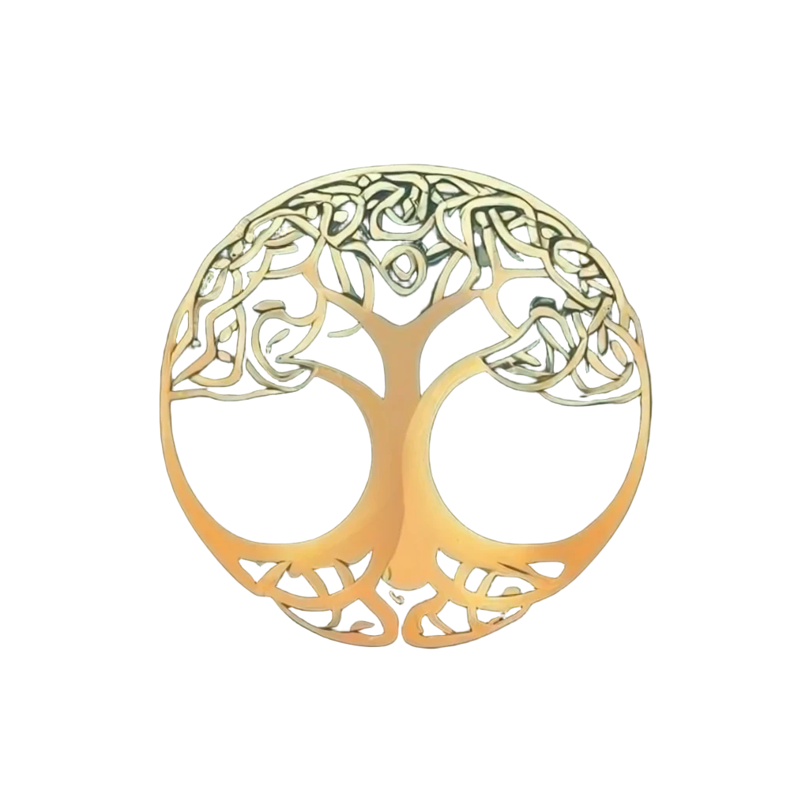

# Genealogy AI

Revolutionizing the way we document biographies and family lineages. Genealogy AI is an open-source service that is currently under work. The tool hopes in utilizing the power of LLMs in understanding complex graphical structures and summarizing familiy information easier. 

## To-Do

- ~~Style Family Tree with [D3.js](https://d3js.org/getting-started)~~
- Set up [Llama 3.1 405B Instruct](https://huggingface.co/meta-llama/Meta-Llama-3.1-405B-Instruct)
- Implement CoT and ReAct
- Use ML Techniques to show geographical timelapse
- Improve usage of [django neomodel](https://github.com/neo4j-contrib/django-neomodel)

## Getting Started 

If your looking to contribute to the codebase or just want to use the app you can follow the following steps. 

### Pre-Requisites 
- Have [NEO4J Desktop](https://neo4j.com/download/) installed


**1. Clone via git** 
```
git clone https://github.com/vijdaancoding/genealogy-ai.git
```
**2. Installing Requirements** 
```
pip install -r genealogy_ai/requirements.txt
```
**3. Import Sample Data and Connect to NEO4J**
```
python manage.py import_data --url bolt://<username>:<password>@localhost:7687
```
**4. Run Django App**
```
python manage.py runserver
```
## Troubleshoot

In case of a WebSocket error caused by NEO4J Desktop please follow the steps mentioned [here](https://neo4j.com/developer/kb/explanation-of-error-websocket-connection-failure/)
